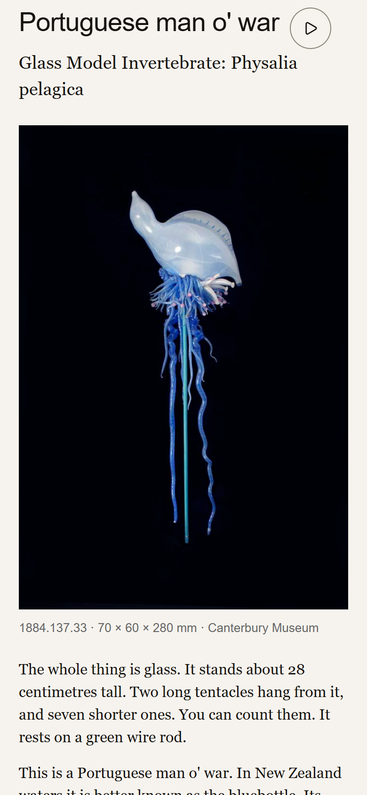

# Portuguese man o' war — a single-object museum companion

A small, focused prototype that brings **one** object from Canterbury Museum's
collection to life by joining its **structured collection record** with the
**unstructured story** told about it across Museum publications.

The object is the Museum's Blaschka glass model of a Portuguese man o' war —
accession **1884.137.33**. You meet it three ways — a photograph, a short video,
and a 3D model — read its story, and test yourself with a three-question quiz.

> Built as a scoped ~2-hour exercise. It is a prototype, not a production app.

**▶ Live demo (nothing to install): <https://manowar.vercel.app>**



---

## Run it

Prefer to run it locally instead of using the [live demo](https://manowar.vercel.app):

```bash
npm install
npm run dev
```

Then open the printed local URL (default <http://localhost:5173>).

- **No API key or config needed.** The collection API only permits requests from
  its own documentation origin, so every API call is routed through a small dev
  proxy defined in [`vite.config.js`](vite.config.js). App code just calls `/api/…`.
- **Phone testing:** `npm run dev -- --host`, then open the laptop's LAN address
  from a phone (the proxy runs on the laptop).
- **Network resilience:** the app makes a real, live API call every session. If it
  fails (e.g. gallery wifi drops mid-demo), it falls back to a committed snapshot
  of the response in [`src/data/fallback.json`](src/data/fallback.json) and warns
  in the console — so it still runs, degrading gracefully rather than blanking out.

Deploying to Vercel/Netlify would use the same `/api` path via a host rewrite to
the collection domain, so the app code is identical in dev and production.

---

## The idea

### Who it's for, and the need it addresses

The intended user is a **museum visitor — in the gallery — standing in
front of this one object and wanting more than the label offers.**

A physical label gives you a few lines. The genuinely interesting story — that a
man o' war is *not one animal* but a colony; *why* it had to be modelled in glass;
who the Blaschkas were; how it reached Christchurch in 1883 — is scattered across
publications the visitor will almost never read. Meanwhile the collection database
holds the hard facts (dimensions, dates, images, provenance) in a form that is
accurate but inert.

This prototype closes that gap: it weaves the **structured record** and the
**publication narrative** into a single, self-paced experience about a single
object. The visitor never sees the seam between "database" and "story" — which is
the point.

### What it connects

| Source | Kind | Used for |
|---|---|---|
| Collection API (`/api/v3/opacobjects…`) | Structured | Title, description, the XLARGE photograph, dimensions, colour palette, accession number, licence — fetched live per session |
| Le Grice, *The Blaschka Collection*; Shaw et al. 2017, *Records of the Canterbury Museum* 31; *The Press*, 1883 | Unstructured | The eight-section story, the reasons and history behind the object, and the quiz — hand-assembled into the reading sheet |

The structured record *is* the object on screen; the unstructured story is the
reading sheet and quiz wrapped around that same object.

---

## Decisions and assumptions

- **One object, done properly — not a shallow browser over many.** With a two-hour
  budget, going deep on a single record produces something considered and working,
  rather than a thin catalogue skim. The data layer (one API call, fields looked up
  by identifier) generalises cleanly to any object.
- **The object fills the screen in three forms.** Photograph (the documentary
  record), a short generated video, and a generated 3D model you can orbit. Chrome
  floats over it; the object is the hero.
- **Honest attribution.** The video and 3D model are AI-generated from the Museum's
  photographs, and are labelled as such. The 3D model additionally says *"not a
  scan"*, because a 3D view invites the assumption that you are looking at measured
  reality — you are not.
- **Second-hand quotes are marked as such.** *The Press*'s 1883 line about the model
  is attributed in-line as *"Quoted in Le Grice"*, because that publication was read
  second-hand, not consulted directly. Sources are credited as live links, not
  claimed as first-hand where they weren't.
- **Consistent with the Museum, not just "museum-like."** The story sheet's type and
  colour are copied from the Museum's own object-detail pages.
- **CORS reality:** the API refuses all origins but the vendor's docs browser, so
  JSON must go through a server-side hop. Images are exempt (CORS only bites
  `fetch`), so they load directly from the Museum.
- **State persistence is free, not built:** your pan position, 3D camera angle,
  video position and quiz progress persist because the relevant elements are kept
  mounted and toggled by visibility — nothing is serialised or restored.
- **Assumptions:** the default view is the photograph; the quiz is self-paced with
  no timer; the audio guide keeps playing while you read.

**Deliberately out of scope:** browsing the wider collection; resolving the
*Physalia pelagica* / *physalis* species-name discrepancy between Museum sources;
and — by design — ever telling the visitor which facts came from the database and
which from the publications.

---

## What I'd improve or build next

- **Improve the user interface.** Refine the UI, apply my craft, and make panning the
  3D model more discoverable (it's right-click / two-finger drag today, which isn't obvious).
- **Explore and validate the quiz.** Real opportunity for a museum-wide feature, 
  multiplayer quiz within the museum's own app. Think Kahoot. Needs validation.
- **Generalise from one object to many.** The field mapping already supports it; add
  a small "related objects" strip driven by a collection query (e.g. the whole
  Blaschka set) so one object becomes a doorway into others.
- **Investigate AI-generated code.** Inspect the code in more detail, look for 
  refactoring opportunities.
- **Include test cases.** Add and improve test cases.
- **A provenance layer for the curious.** Optionally let an interested or expert user
  toggle *"where did this claim come from?"* to reveal the structured-vs-publication
  sourcing that is deliberately seamless by default.
- **Refine the assets.** Refine the generated video, 3D model and transcript for the audio.
- **Accessibility pass.** Keyboard navigation, focus
  management, and proper labelling throughout.
- **Performance on gallery wifi.** The 3D and video assets are ~10–30MB; add smarter
  lazy-loading, smaller derivatives, and real device/network testing.
- **Follow the loose threads.** Surface the genuinely interesting unresolved details
  the research turned up (e.g. an undocumented `EQRC` identifier that plausibly ties
  to the 2011 earthquake conservation backlog).

---

## AI assistance

The brief asks for this explicitly, so in full:

- **Development.** The application was built with **Claude (Anthropic)** operating as
  an agentic coding assistant. I directed it from a written specification and
  reviewed the work step by step; the assistant wrote the Vite/React code, ran the
  app in a browser to verify each step against the spec, and diagnosed issues along
  the way (for example, a `<model-viewer>` camera that reset when hidden, and a
  pan/zoom library whose transforms only appeared frozen because the test browser
  ran as a background tab).
- **Generated media.** The three non-photographic representations of the object —
  the short **video**, the **3D model**, and the spoken **audio guide** — were
  produced with generative-AI tools (Figma Weave) from the Museum's own photographs and the
  written narrative. They are labelled in the interface as generated (and the 3D
  model as *not a scan*) so a visitor is never misled about what is real.

---

## Tech

- **Vite + React** — small but genuinely stateful (canvas mode, three kinds of
  persisted position, audio, sheet, quiz). No UI framework, component library, or
  state library.
- **[`<model-viewer>`](https://modelviewer.dev/)** for the GLB (orbit / pan / pinch,
  touch and mouse) — loaded via a single script tag.
- **[`@panzoom/panzoom`](https://github.com/timmywil/panzoom)** for image pan/zoom.

## Sources

- Collection record — Canterbury Museum **1884.137.33**
  <https://collection.canterburymuseum.com/objects/glass-model-invertebrate-physalia-pelagica>
- Le Grice R., *The Blaschka Collection*
  <https://www.canterburymuseum.com/explore/collections/the-blaschka-collection>
- Shaw MD et al. (2017), *Ideas made glass: Blaschka glass models at Canterbury
  Museum*, **Records of the Canterbury Museum 31**
  <https://cms.canterburymuseum.com/assets/Canterbury-Museum-Records-2017.pdf>
